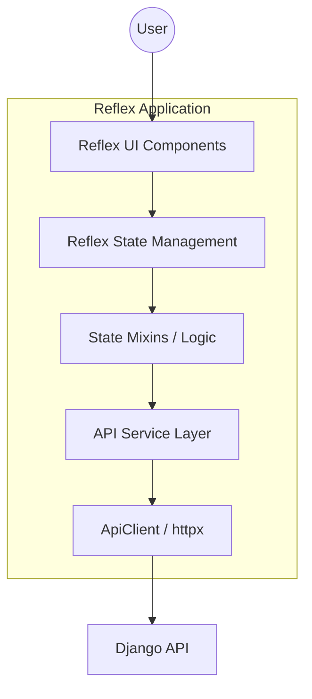

# Reflex Frontend Overview

## Architectural Vision

The Finance Manager Reflex frontend is designed as a high-performance, reactive Graphical User Interface (GUI) that prioritizes a **"Soft Modern"** aesthetic and a premium user experience. It serves as the primary touchpoint for users to interact with their financial data, providing intuitive workflows for transaction management, dashboard visualization, and account configuration.

### Core Principles

1. **Reactivity First**: Leveraging Reflex's state-driven architecture to ensure the UI is always in sync with the underlying data.
2. **"Soft Modern" Aesthetic**: Moving away from blocky, high-contrast designs towards a more premium feel using rounded corners (`lg` radius), subtle shadows, and glassmorphism.
3. **Senior-Level Logic**: Each component and state follows strict separation of concerns, ensuring that UI code remains clean while business logic is encapsulated in state mixins.
4. **Resilient Integration**: A robust API client handles JWT lifecycles, automatic token refreshing, and standardized error normalization.

## Technology Stack

- **Framework**: [Reflex](https://reflex.dev/) (Full-stack Python web framework).
- **Icons**: [Lucide](https://lucide.dev/) (via `rx.lucide`).
- **Styling**: Custom design tokens and primitives wrapping Radix UI components.
- **Networking**: `httpx` for asynchronous API calls.
- **Authentication**: JWT (JSON Web Tokens) stored in secure cookies.

## System Architecture




### Layered Responsibility

- **UI Layer (`ui/`)**: Contains reusable primitives and theme definitions. No business logic should reside here.
- **State Layer (`features/*/state.py`)**: Manages UI state, handles user events, and coordinates API calls.
- **Service Layer (`features/*/api.py`)**: Encapsulates endpoint-specific logic and payload formatting.
- **Core Layer (`core/`)**: Provides shared utilities like the `ApiClient`, `AuthState`, and global configuration.

## Project Structure

```text
finance_manager_reflex/
├── app/                # Global app config, routes, and layout guards
├── core/               # Shared services (API client, Auth, Config)
├── features/           # Feature-based modules (Dashboard, Transactions, etc.)
│   ├── agentdash/      # Main dashboard visualization
│   ├── auth/           # Login and Registration
│   ├── data_hub/       # Export/Import and data management
│   ├── profile/        # User settings and profile management
│   └── transactions/   # Transaction list and filtering
├── models/             # Frontend data models (Pydantic)
├── ui/                 # Design system (Tokens, Primitives, Theme)
└── finance_manager_reflex.py # Application entry point
```

