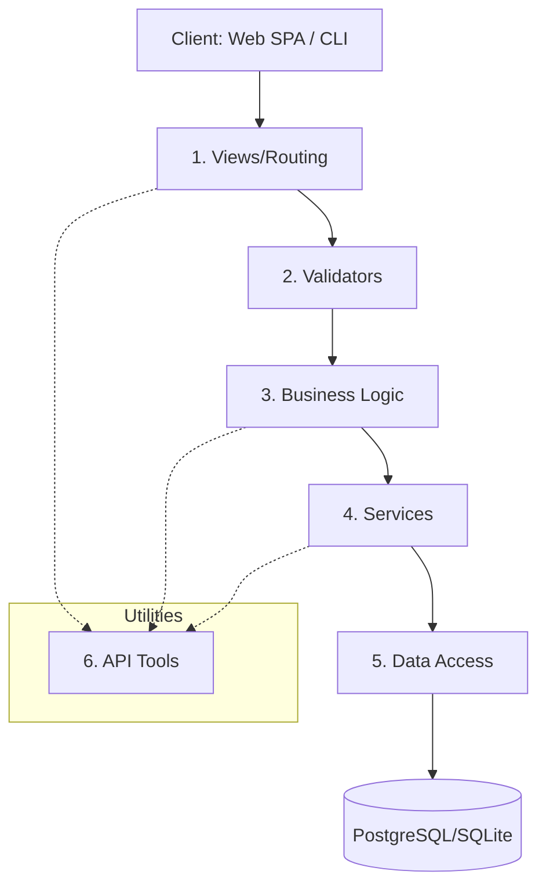

# API Data Flow and Architecture

Related overview: `design_docs/api_docs/00_API_Overview.md`

# API Data Flow & Architecture

The Finance Manager API follows a strict **6-layer architecture**. This separation of concerns ensures that the codebase remains maintainable, scalable, and easy to test.

## The 6-Layer Architecture

Each layer has a specific responsibility and interacts only with the layers directly adjacent to it (or utility layers).

### 1. Views & Routing (`views/`)

- **Responsibility**: Entry point for HTTP requests.
- **Tasks**: URL routing, parsing request data, calling validators, and returning HTTP responses.
- **Golden Rule**: Views should be thin and contain NO business logic or direct database queries.

### 2. Validators (`validators/`)

- **Responsibility**: Ensuring data integrity before processing.
- **Tasks**: Checking request parameters, validating permissions, and ensuring business invariants (e.g., sufficient funds).
- **Golden Rule**: All incoming data MUST be validated before reaching the logic layer.

### 3. Business Logic (`logic/`)

- **Responsibility**: Core operations and calculations.
- **Tasks**: Calculating snapshots, matching transactions to bills, and implementing complex financial rules.
- **Golden Rule**: This is the "brain" of the application. It orchestrates services to achieve a business goal.

### 4. Services (`services/`)

- **Responsibility**: Interfacing with external systems or complex internal subsystems.
- **Tasks**: Handling OAuth2 flows, generating reports, or managing complex state transitions that involve multiple models.
- **Golden Rule**: Services provide a high-level API for the logic layer to use.

### 5. Data Access (`data/`)

- **Responsibility**: Optimized database interactions.
- **Tasks**: Complex SQL queries, aggregations, and bulk operations using Django's ORM (e.g., `prefetch_related`).
- **Golden Rule**: Database hits are capped at **12 per call** (10 is the goal). Direct ORM calls should be encapsulated here.

### 6. API Tools (`api_tools/`)

- **Responsibility**: Shared utilities.
- **Tasks**: Date formatting, currency conversion, custom exceptions, and logging helpers.
- **Golden Rule**: If logic is needed in more than one place, create a tool.

## Request Lifecycle Example

1. **Client** sends a `POST` request to `/finance/transactions/`.
2. **Views** receives the request and extracts the transaction data.
3. **Validators** check if the `amount` is valid and if the `source` exists.
4. **Logic** determines if this transaction affects an upcoming bill.
5. **Services** update the user's financial snapshot.
6. **Data Access** saves the transaction and updates balances in a single transaction block.
7. **Views** returns a `201 Created` response with the new transaction data.

---

**[Return to Overview](file:///home/pproctor/Documents/python/finance_manager/design_docs/api_docs/00_API_Overview.md)**

## Snapshot Recalculation Triggers

Snapshot and related totals are recomputed after relevant writes, including:

- Transactions create/update/delete.
- Sources create/update/delete.
- Upcoming expenses create/update/delete.
- Profile updates affecting spend_accounts/base currency/timezone/week boundaries.

## Signal-Driven Behavior

- User create: seed `AppProfile`, `FinancialSnapshot`, and default sources (`cash`, `unknown`).
- Source delete: remap linked transactions to `unknown` source.
- User delete: clean up finance-domain records.

## OpenAPI Notes

`drf-spectacular` provides schema and docs endpoints. Keep these aligned with implementation details, especially when behavior differs from common REST patterns (for example, source delete body payload form).