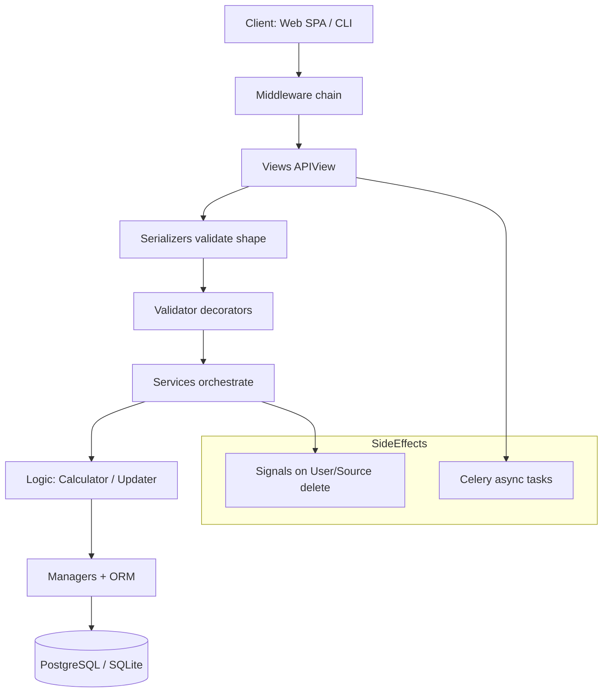

# API Data Flow and Architecture

Related: [API Overview](00_API_Overview.md)

The Finance Manager API uses a **layered pipeline** with thin views, explicit validators, orchestrating services, and pure calculation/update logic. Understanding this flow is required before changing endpoints or financial math.

## Repository layout

```
finance_manager_api/
├── finance_api/          # Django project (settings, urls, celery, wsgi)
├── finance/
│   ├── models.py         # All domain models
│   ├── views/            # APIView entry points (one module per domain)
│   ├── services/         # Orchestration (@validator decorators, atomic blocks)
│   ├── logic/            # fincalc, updaters, bill_recurrence, pay_cycle, balance_snapshots
│   ├── validators/       # Domain validation decorators + rules
│   ├── management/       # managers.py (custom QuerySets), commands/
│   ├── api_tools/        # serializers, signals, query_utils, tos
│   ├── middleware/       # PWA write contract, observability, log context
│   ├── tasks/            # Celery tasks (must keep __init__.py for beat registration)
│   └── tests/            # pytest tree by domain
└── pyproject.toml / uv.lock
```

There is **no** `finance/urls.py` — all routes are flat-listed in `finance_api/urls.py`.

## Request pipeline



### Layer responsibilities

| # | Layer | Location | Responsibility |
| :--- | :--- | :--- | :--- |
| 1 | **Middleware** | `finance/middleware/` | PWA idempotency/build gate, observability counters, per-user log context, optional DB hit counting (DEBUG) |
| 2 | **Views** | `finance/views/` | HTTP entry: parse query/body, call serializer, delegate to service, return DRF `Response`. **No business math.** |
| 3 | **Serializers** | `finance/api_tools/serializers/` | Request/response contracts (mostly plain `Serializer`, not `ModelSerializer`). Return envelopes with `accepted` / `rejected` / `snapshot`. |
| 4 | **Validators** | `finance/validators/` | Decorators (`@UserValidator`, `@TransactionValidator`, …) enforce invariants before service entry. |
| 5 | **Services** | `finance/services/` | Atomic workflows: load profile, call `Updater` fixers, persist, trigger snapshot recompute. |
| 6 | **Logic** | `finance/logic/` | **Calculator** (read-only math), **Updater** (mutations + snapshot), **bill_recurrence**, **pay_cycle**, **convert_currency**, **balance_snapshots**. |
| 7 | **Data access** | `finance/management/managers.py` | Custom `QuerySet` + `.for_user(uid)` scoping on every model manager. |

**Golden rules**

- Views stay thin; financial rules live in `logic/` and `validators/`.
- Always scope queries: `Model.objects.for_user(uid)` — never unscoped `.all()` on user data.
- Mutations that affect balances or STS inputs must end in `Updater._tx_snapshot_handler` (directly or via handlers).

## Typical write lifecycle (transaction create)

1. **Client** `POST /finance/transactions/` with JSON body (single object or list for bulk).
2. **PwaWriteContractMiddleware** — if `Idempotency-Key` present on allowlisted path, replay or record response; enforce `X-Client-Build` when `CLIENT_BUILD_MIN_WRITE` set.
3. **TransactionListCreateView** — rejects client-supplied `tx_id` / `entry_id` (403).
4. **TransactionSerializer** validates shape; **TransactionValidator** checks source, currency, dates.
5. **transaction_services.create_transaction** (decorated, atomic):
   - `Updater.fix_tx_data` — sign normalization, `tx_id` generation, defaults.
   - Save row; adjust `PaymentSource.amount`; link bill if named.
   - `Updater.transaction_handler` → snapshot rebuild.
6. **Response** — `TransactionSetReturnSerializer` with `accepted`, optional `rejected`, and fresh `snapshot` block.

## The decoupled `uid` model

Most relationships are **not** Django `ForeignKey` fields. Instead:

- `uid` on `Transaction`, `PaymentSource`, `UpcomingExpense`, etc. stores `AppProfile.user_id` (UUID string).
- `category`, `source`, `bill`, `tags` are **string or JSON** references by name, not ORM relations.

**Why:** historical performance/migration flexibility; documented in `models.py` TODO block.

**Implications for developers**

- Cascading deletes do **not** happen automatically — `pre_delete` on `User` manually wipes all `uid`-keyed rows.
- `pre_delete` on `PaymentSource` reassigns transactions to reserved source `unknown`.
- **Exceptions:** `SavingsGoal` and `ExportShareToken` use real FKs to `AppProfile` (and `PaymentSource` for goals).

Referential checks happen in validators and services, not the database (except unique constraints per `(name, uid)` etc.).

## FinancialSnapshot denormalization

Each user has one [`FinancialSnapshot`](03_Models_Reference.md) row (keyed by `uid`). Fields like `safe_to_spend`, `total_assets`, `total_monthly_spending` are **cached aggregates** rebuilt by `Updater._tx_snapshot_handler` using `Calculator`.

**Recompute triggers** (non-exhaustive):

- Transaction create / update / delete (with optimization: PATCH skips recompute if only non-balance fields changed).
- Source create / update / delete.
- Upcoming expense create / update / delete / catch-up.
- Profile changes to `spend_accounts`, `base_currency`, `timezone`, pay-cycle STS fields.

Clients should treat `GET /finance/appprofile/snapshot/` as the dashboard truth after writes (response includes `snapshot` on many mutating endpoints).

## Signals (`finance/api_tools/signals.py`)

Registered in `finance.apps.FinanceConfig.ready()`.

| Signal | Trigger | Action |
| :--- | :--- | :--- |
| `post_save` | `User` created | Create `AppProfile`, `FinancialSnapshot`, default sources `cash` + `unknown` |
| `user_logged_in` | Login | Self-heal missing profile or `unknown` source |
| `pre_delete` | `PaymentSource` | Reassign orphaned transactions to `unknown` (skippable during bulk user delete) |
| `pre_delete` | `User` | Delete all finance rows keyed by `uid` (transactions, expenses, categories, tags, sources, snapshot) |

`apps.py` also patches SimpleJWT / dj-rest-auth refresh serializers to avoid schema collisions and map deleted-user refresh to `401 InvalidToken`.

## Middleware (order matters)

Configured in `finance_api/settings.py`:

1. `corsheaders` — CORS for web origins; allows `x-client-build`, `idempotency-key`.
2. `SecurityMiddleware`, `SessionMiddleware`, `CommonMiddleware`, `CsrfViewMiddleware`, `AuthenticationMiddleware`, `Axes` backend.
3. `DBHitCounterMiddleware` — DEBUG query counting.
4. `UserLogContextMiddleware` — loguru user context.
5. **`PwaWriteContractMiddleware`** — D2 offline outbox contract (idempotency replay, client build gate).
6. **`ObservabilityMiddleware`** — Redis counters, salted IP hashes, route-pattern keys.

## Celery and beat

App: `finance_api/celery.py` (`autodiscover_tasks`). **`finance/tasks/__init__.py` must exist** or beat tasks silently fail to register (guarded by `test_celery_task_registration.py`).

| Task | Schedule (UTC) | Purpose |
| :--- | :--- | :--- |
| `balance_snapshots.capture_balance_snapshots` | 00:15 daily | F-001 day-end balances per source |
| `usage_rollup.rollup_daily_usage` | 00:05 daily | F-014 DAU/MAU |
| `analytics.rollup_metrics_hourly` | :05 each hour | Drain Redis metrics → JSONL |
| `analytics.rollup_daily` | 00:10 daily | Daily analytics summary |
| `analytics.rollup_weekly` | Mon 00:10 | Weekly summary |
| `security_alerts.check_security_thresholds` | every 15 min | Auth failure / 5xx thresholds |
| `support_digest.send_weekly_feature_requests_email` | Mon 09:00 | Feature-request digest |
| `notify.notify_operator` | on-demand | Operator email from support intake |
| `notify.send_user_support_confirmation` | on-demand | User ticket confirmation |

Management commands: `backfill_balance_snapshots`, `update_conversion_file`, `create_ux_testuser`, `prod_setup`, etc.

## OpenAPI / contract drift

- Views use `@extend_schema` for drf-spectacular.
- **Swagger** (`/api/docs/`) is the live contract checker when in doubt.
- Several endpoints are non-RESTful (name-keyed detail URLs, bulk POST lists, savings goals without serializers) — the written docs and OpenAPI should match implementation, not generic REST expectations.

## Where to change what

| Goal | Start here |
| :--- | :--- |
| New endpoint | `finance_api/urls.py` + new `APIView` + service + serializer + tests |
| STS / safe-to-spend formula | `finance/logic/fincalc.py`, pay-cycle in `pay_cycle.py` |
| Post-write side effects | `finance/logic/updaters.py` |
| Bill due-date advancement | `finance/logic/bill_recurrence.py`, `expense_services` |
| Query filters / performance | `finance/management/managers.py`, `api_tools/query_utils.py` |
| Auth behavior | `finance_api/urls.py` (token views), `settings.py`, `usr_views.py` |
| PWA offline replay | `finance/middleware/pwa_write_contract.py`, `IdempotencyRecord` model |

---

**[Return to Overview](00_API_Overview.md)** · **Next:** [Endpoints & Contracts](01_Endpoints_and_Contracts.md)
