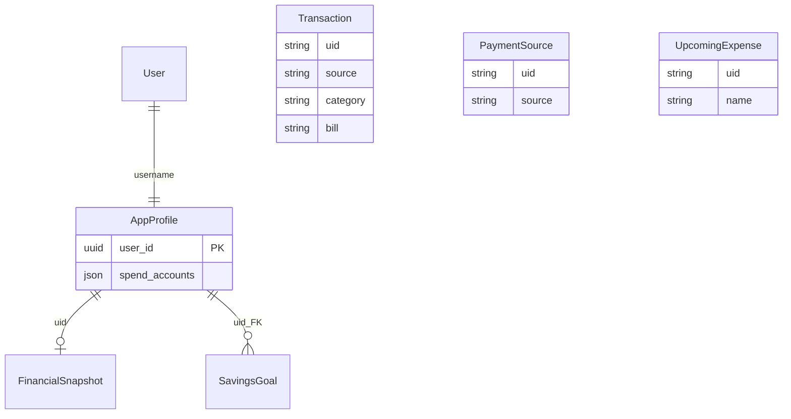

# Models Reference

Related: [API Overview](00_API_Overview.md) · [Business Rules](03_Business_Rules_and_Invariants.md)

All domain models live in [`finance/models.py`](../../finance_manager_api/finance/models.py). Custom managers are in [`finance/management/managers.py`](../../finance_manager_api/finance/management/managers.py).

Migrations: `finance/migrations/` (`0001`–`0018` as of tight beta).

## Architectural note: decoupled `uid`

Most models reference ownership via **`uid`** (`CharField` holding `AppProfile.user_id` as string) and **name-based** links (`source`, `category`, `bill`) rather than Django `ForeignKey`. Exceptions noted below.

Integrity: validators + services + signals (see [Validators & Tools](07_Validators_and_Tools.md)).

---

## AppProfile

Central user configuration. **PK:** `user_id` (UUID). Created automatically on user signup.

| Field | Type | Default | Description |
| :--- | :--- | :--- | :--- |
| `username` | `OneToOneField(User)` | — | Django auth user |
| `user_id` | `UUIDField` | `uuid4` | Primary key; copied to `uid` on other models |
| `spend_accounts` | `JSONField` (list) | `[]` | Source **names** treated as spendable for STS (not M2M) |
| `base_currency` | `CharField(3)` | `USD` | Conversion target for aggregates |
| `timezone` | `CharField` | `America/New_York` | IANA timezone for date boundaries |
| `start_of_week` | `IntegerField` | `1` | 0=Mon … 6=Sun for calendar UI |
| `completed_tours` | `JSONField` | `[]` | F-007 guided tour progress |
| `tos_version` | `CharField` | — | Clickwrap version accepted |
| `tos_accepted_at` | `DateTimeField` | — | Server-set acceptance time |
| `sts_window_mode` | `CharField` | `calendar_month` | `calendar_month` or `pay_cycle` (F-004) |
| `pay_cycle_frequency` | `CharField` | — | `weekly` / `biweekly` / `semimonthly` / `monthly` |
| `pay_cycle_anchor_date` | `DateField` | — | Anchor for pay-cycle window |

**Manager:** `AppProfileManager` — `for_user`, `get_base_currency`, `get_timezone`, etc.

---

## Transaction

Individual ledger entries.

| Field | Type | Description |
| :--- | :--- | :--- |
| `uid` | `CharField` | Owner `user_id` string |
| `tx_id` | `CharField` | Business id `YYYY-MM-DD-XXXXXXXX` (server-generated) |
| `date` | `DateField` | Transaction date |
| `created_on` | `DateField` | Record creation date |
| `description` | `CharField` | Free text |
| `amount` | `Decimal(10,2)` | Signed per `tx_type` (expenses negative) |
| `category` | `CharField` | Category **name** (not FK) |
| `source` | `CharField` | PaymentSource **name** |
| `currency` | `CharField(3)` | ISO code |
| `tags` | `JSONField` (list) | Tag name strings |
| `bill` | `CharField` | Optional UpcomingExpense **name** |
| `tx_type` | `CharField` | `EXPENSE`, `INCOME`, `XFER_IN`, `XFER_OUT` |

**Constraints:** `unique_together (tx_id, uid)` · **Ordering:** `-date`

**Manager:** `TransactionManager` — filtering by month, tag (JSON), type, bill linkage, etc.

---

## PaymentSource

Account / wallet balances.

| Field | Type | Default | Description |
| :--- | :--- | :--- | :--- |
| `source` | `CharField` | — | Unique name per user |
| `acc_type` | `CharField` | `UNKNOWN` | `SAVINGS`, `CHECKING`, `CASH`, `INVESTMENT`, `EWALLET`, `UNKNOWN` |
| `currency` | `CharField` | `USD` | Account currency |
| `amount` | `Decimal(15,2)` | `0` | Current balance (updated by `Updater` on tx writes) |
| `uid` | `CharField` | — | Owner |

**Constraints:** `unique_together (source, uid)`

Reserved **`unknown`**: system source; protected from user mutation.

---

## UpcomingExpense (bills)

| Field | Type | Default | Description |
| :--- | :--- | :--- | :--- |
| `name` | `CharField` | — | Unique per user |
| `amount` | `Decimal(10,2)` | — | Nominal bill amount |
| `due_date` | `DateField` | — | Next due date |
| `start_date` | `DateField` | — | Recurrence anchor |
| `end_date` | `DateField` | null | Optional end |
| `paid_flag` | `BooleanField` | `False` | Satisfied for current period |
| `is_recurring` | `BooleanField` | `False` | Whether bill repeats |
| `currency` | `CharField` | — | Bill currency |
| `uid` | `CharField` | — | Owner |
| `bill_class` | `CharField` | — | `rigid` or `volatile` (F-004) |
| `planned_partial_amount` | `Decimal` | null | Partial payment plan |
| `cycle_residual_amount` | `Decimal` | null | Remaining obligation this cycle |
| `remainder_due_date` | `DateField` | null | When residual is due |
| `cadence` | `CharField` | `monthly` | Recurrence engine cadence |
| `custom_interval_days` | `IntegerField` | null | Required when `cadence=custom` |

**Constraints:** `unique_together (name, uid)`; `planned_partial_amount <= amount`; custom cadence requires positive interval days.

---

## Category

| Field | Type | Description |
| :--- | :--- | :--- |
| `name` | `CharField` | Unique per user |
| `uid` | `CharField` | Owner |

System defaults (`expense`, `income`, `transfer`) are protected from destructive API operations.

---

## Tag

One row per user storing **all** tag names:

| Field | Type | Description |
| :--- | :--- | :--- |
| `tags` | `JSONField` (list) | All tag strings for user |
| `uid` | `CharField` | Owner |

---

## FinancialSnapshot

Denormalized dashboard cache — **one row per user** (`uid` PK).

| Field | Description |
| :--- | :--- |
| `total_assets` | Sum of account balances (converted) |
| `safe_to_spend` | Spendable accounts minus unpaid obligations in STS window |
| `total_savings`, `total_checking`, `total_investment`, `total_cash`, `total_ewallet` | Per-type totals |
| `total_monthly_spending` | Expenses in current month window |
| `total_remaining_expenses` | Unpaid bills in STS window |
| `total_leaks` | Transfer imbalance magnitude (`XFER_IN` + `XFER_OUT` net) |

Rebuilt by `Updater._tx_snapshot_handler` using `Calculator`.

---

## SavingsGoal (F-005)

Uses **real foreign keys** (unlike most domain models):

| Field | Type | Description |
| :--- | :--- | :--- |
| `uid` | `FK → AppProfile` | Owner |
| `source` | `FK → PaymentSource`, `SET_NULL` | Optional linked account |
| `name` | `CharField` | Goal label |
| `target_amount` | `Decimal` | Target |
| `currency` | `CharField` | Goal currency |
| `target_date` | `DateField` | Target date |
| `current_amount` | `Decimal` | Progress |

---

## BalanceSnapshot (F-001)

Day-end closing balance per source.

| Field | Type | Description |
| :--- | :--- | :--- |
| `uid` | `CharField` | Owner |
| `source` | `CharField` | Source name |
| `snapshot_date` | `DateField` | Calendar date |
| `closing_balance` | `Decimal` | Balance in source currency |
| `currency` | `CharField` | Source currency at capture |

**Constraints:** `unique_together (uid, source, snapshot_date)` · index `(uid, snapshot_date)`

---

## Operational & support models

### ExportShareToken (audit only)

FK to `AppProfile`. **Endpoints removed 2026-06-29**; migration `0018` cleared rows. Do not build new features against this model.

### IdempotencyRecord (PWA D2)

| Field | Description |
| :--- | :--- |
| `uid`, `key_hash` | Unique per user + idempotency key |
| `method`, `path`, `status_code`, `response_body` | Replay cache |

### SupportTicket (F-012)

| Field | Description |
| :--- | :--- |
| `id` | UUID PK |
| `report_type` | `BUG` / `FEATURE` |
| `severity`, `nature`, `comment` | User report (redacted on write) |
| `diagnostic_log_key` | F-013 incident file reference |
| `emailed` | Digest / notification flags |

### DailyUsageSnapshot (F-014)

Operator DAU/MAU rollup storage.

### InviteChainEvent (F-014)

Growth analytics scaffold — not yet populated in production flows.

### OperatorAlertState

Dedupes threshold alert emails (24h window).

---

## Entity relationship (logical)

Solid lines = real FK; dashed semantics = string `uid` / name coupling.

---

**[Return to Overview](00_API_Overview.md)**
