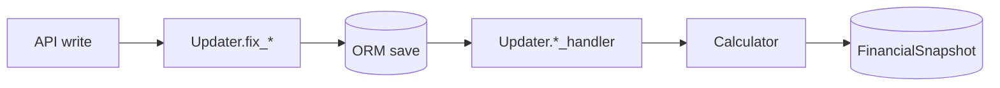

# Business Logic Reference

Related: [Business Rules](03_Business_Rules_and_Invariants.md) · [Data Flow](02_Data_Flow_and_Architecture.md)

Core financial computation and mutation logic lives in [`finance/logic/`](../../finance_manager_api/finance/logic/). Services call into these modules; views should not import them directly except through services.

---

## Module map

| Module | Role |
| :--- | :--- |
| [`fincalc.py`](../../finance_manager_api/finance/logic/fincalc.py) | Read-only `Calculator` — aggregates, STS, leaks |
| [`updaters.py`](../../finance_manager_api/finance/logic/updaters.py) | Stateful `Updater` — fixers, handlers, snapshot rebuild |
| [`bill_recurrence.py`](../../finance_manager_api/finance/logic/bill_recurrence.py) | Cadence intervals, due-date advancement, catch-up |
| [`pay_cycle.py`](../../finance_manager_api/finance/logic/pay_cycle.py) | Pay-cycle window `[start, end)` for STS |
| [`convert_currency.py`](../../finance_manager_api/finance/logic/convert_currency.py) | ECB rate conversion (strict — fails if rate missing) |
| [`balance_snapshots.py`](../../finance_manager_api/finance/logic/balance_snapshots.py) | F-001 closing balances + history API |
| [`validators.py`](../../finance_manager_api/finance/logic/validators.py) | Re-export shim → `finance/validators/` |

---

## Calculator (`fincalc.py`)

Instantiated with an `AppProfile` (or uid). All public totals convert to **`base_currency`** via `_calc_totals(from_currency, to_currency, amount)`.

### Key methods

| Method | Purpose |
| :--- | :--- |
| `calc_sts()` | **Safe-to-spend** = spendable account balances minus unpaid bill obligations in STS window |
| `calc_total_assets()` | Sum of account balances (excludes `UNKNOWN` acc_type handling per implementation) |
| `calc_leaks()` | Transfer imbalance: magnitude of net `XFER_IN` + `XFER_OUT` |
| `calc_acc_types()` | Totals grouped by `acc_type` |
| `calc_tx_sources()` | Per-source balance rollups from transactions |
| `calc_current_month_expense_spending()` | Expense sum for calendar month |
| `calc_upcoming_bills_base_total()` | Unpaid bills total in window |
| `calc_queryset(qs)` | Sum any transaction queryset into base currency |

### STS window (F-004)

Controlled by `AppProfile.sts_window_mode`:

- **`calendar_month`** — unpaid bills due in current calendar month (timezone-aware).
- **`pay_cycle`** — uses `current_pay_cycle_window(profile, today)` from `pay_cycle.py` based on `pay_cycle_frequency` + `pay_cycle_anchor_date`.

### Effective bill amount (partial payments)

`_effective_bill_amount(expense)` precedence:

1. `planned_partial_amount` (if set)
2. else `cycle_residual_amount`
3. else full `amount`

Used when computing obligations for STS and remaining-expense totals.

---

## Updater (`updaters.py`)

Stateful side effects after CRUD. Accepts optional preloaded lists to reduce DB round-trips during bulk operations.

### Fixers (normalization before save)

| Method | Normalizes |
| :--- | :--- |
| `fix_tx_data` | Signs, `tx_id` generation, dates, currency casing, category defaults |
| `fix_source_data` | Source fields, currency uppercase |
| `fix_expense_data` | Bill fields, cadence coherency |

### Handlers (after persist)

| Handler | Effects |
| :--- | :--- |
| `transaction_handler` | Adjust `PaymentSource.amount`; bill link + recurring roll; `_tx_snapshot_handler` |
| `expense_handler` | Rename/delete propagation to tx `bill` field; snapshot |
| `source_handler` | Snapshot on source CRUD |
| `user_handler` | Profile-driven snapshot refresh |
| `category_changed` / `category_deleted` | Remap transaction categories |

### Snapshot rebuild

`_tx_snapshot_handler` loads transactions, sources, expenses (or uses cached lists), runs `Calculator`, writes all `FinancialSnapshot` fields.

**Optimization:** `transaction_services.update_transaction` skips snapshot recompute when PATCH only touches non-balance fields (unless `date`/`bill` change on bill-linked tx).

### Bill payment roll-forward

`_handle_upcoming` when a transaction references a bill:

1. Mark bill paid for period (internal flags).
2. If recurring, call `advance_bill_due_date` from `bill_recurrence.py`.
3. Reset `paid_flag` for next cycle.

---

## Bill recurrence (`bill_recurrence.py`)

First-class engine driven by `UpcomingExpense.cadence` (migration `0017`). Replaces legacy inference from `start_date`/`due_date` delta alone.

| Cadence | Advance behavior |
| :--- | :--- |
| `weekly` / `biweekly` | Fixed day steps |
| `semimonthly` | Anchors 1st and 15th |
| `monthly` / `quarterly` / `annual` | `relativedelta` |
| `custom` | `custom_interval_days` |

| Function | Purpose |
| :--- | :--- |
| `bill_interval_step(cadence, ...)` | Delta for one period |
| `advance_bill_due_date(expense, periods=1)` | Move `due_date` forward |
| `periods_behind(expense, today)` | Overdue period count (catch-up) |

`MAX_CATCH_UP_PERIODS = 24` caps `POST .../catch-up/`.

---

## Pay cycle (`pay_cycle.py`)

`current_pay_cycle_window(profile, today)` → `(start, end)` date range for STS when `sts_window_mode=pay_cycle`.

Frequencies: `weekly`, `biweekly`, `semimonthly`, `monthly` — anchored on `pay_cycle_anchor_date`.

Savings goals use the same frequency metadata to compute `per_cycle_required` in views.

---

## Currency conversion (`convert_currency.py`)

Uses `settings.CURRENCY_CONVERTER` (loaded from `finance/data/exchange_rates.zip`, ECB rates).

- **No silent fallback** — missing file or unknown pair raises.
- CI runs `update_conversion_file` before tests.
- Supported currency list derived from rate file at startup.

---

## Balance snapshots (`balance_snapshots.py`) — F-001

| Function | Purpose |
| :--- | :--- |
| `closing_balances_as_of(uid, date)` | Compute per-source closing balances |
| `persist_snapshots_for_date(uid, date)` | Upsert `BalanceSnapshot` rows |
| `get_balance_history(uid, range, ...)` | API backing for `/finance/balance-history/` |
| `resolve_date_range(preset, start, end)` | `7d` / `30d` / `90d` / `all` |

Nightly Celery `capture_balance_snapshots` at 00:15 UTC. Backfill: `manage.py backfill_balance_snapshots`.

---

## Service layer (orchestration)

[`finance/services/`](../../finance_manager_api/finance/services/) — entry from views:

| Service | Domains |
| :--- | :--- |
| `transaction_services` | CRUD, calendar, visualization queries |
| `expense_services` | Bills + catch-up |
| `source_services` | Sources |
| `category_services` | Categories |
| `tag_services` | Tags |
| `user_services` | User lifecycle helpers |
| `support_incident` | F-013 diagnostic dump paths |

Decorators stack: `@UserValidator` + domain validator + `@transaction.atomic`.

---

## Mental model for changes

**Read-only analytics** (calendar, visualization GET) use `Calculator` + managers without `Updater` unless caching changes later.

**Do not** duplicate STS math in the web PWA offline layer — server snapshot is authoritative; offline overlay only approximates for UX (see web offline docs).

---

**[Return to Overview](00_API_Overview.md)**
