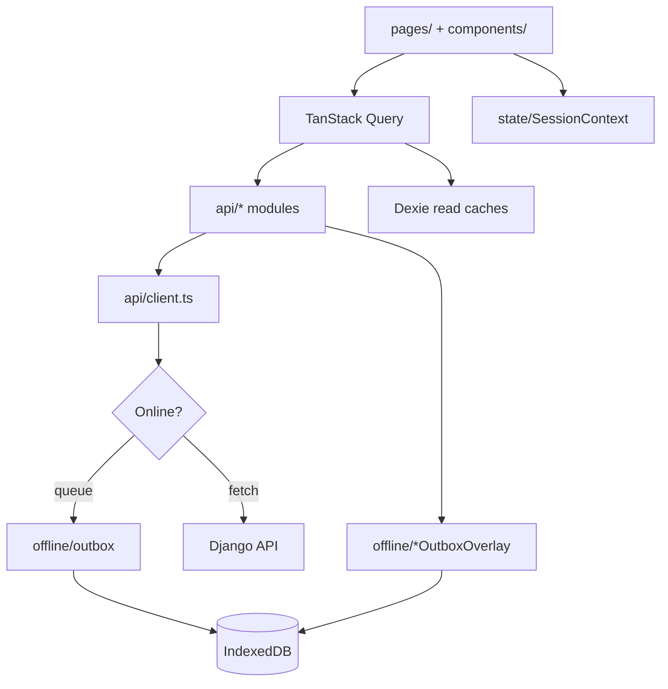

# Application Architecture

Related: [Web Overview](00_Web_Overview.md)

Structural map of `finance_manager_web/src/`. The web client separates **network access**, **offline persistence**, **server cache**, and **session state** into distinct layers — do not mix concerns across them.

## Top-level `src/` layout

```
src/
  main.tsx                 # Bootstrap + provider tree
  App.tsx                  # Routes + sync chrome
  registerPwa.ts           # Service worker registration + version eviction
  index.css                # Global styles (+ design tokens)

  api/                     # HTTP client + typed API modules (ONLY network I/O)
  offline/                 # Dexie DB, outbox, overlays, seed, connectivity
  state/                   # Auth tokens + SessionContext + onboarding flags
  routes/                  # RequireAuth guard
  layout/                  # PublicShell, ProtectedShell, LegalPageShell
  pages/                   # Route-level screens (one folder per feature area)
  components/              # Reusable UI, dashboard widgets, tours, sync banners
  lib/                     # Framework-agnostic helpers (i18n, money, query client, theme)
```

## Layer responsibilities



| Layer | Owns | Must not |
| :--- | :--- | :--- |
| `pages/` | UI composition, forms, route params | Direct `fetch` / raw axios |
| `api/` | Request/response typing, endpoint paths | UI state or Dexie writes (except via client adapter) |
| `offline/` | Queue, replay, cache keys, overlays | React components (except `OfflineRoot`) |
| `state/` | JWT storage, session boolean, onboarding local flags | Server data caching |
| `lib/queryClient.ts` | TanStack Query defaults + shared `queryClient` | Domain-specific queryFns (those live in `api/`) |

## `api/` modules

| Module | Endpoints / role |
| :--- | :--- |
| [`client.ts`](../../finance_manager_web/src/api/client.ts) | Axios instance, interceptors, offline adapter |
| [`refreshClient.ts`](../../finance_manager_web/src/api/refreshClient.ts) | Bare client for `POST /api/token/refresh/` |
| [`types.ts`](../../finance_manager_web/src/api/types.ts) | Shared TS types for API envelopes |
| [`auth.ts`](../../finance_manager_web/src/api/auth.ts) | Login / signup |
| [`snapshot.ts`](../../finance_manager_web/src/api/snapshot.ts) | `GET /finance/appprofile/snapshot/` |
| [`profile.ts`](../../finance_manager_web/src/api/profile.ts) | App profile GET/PATCH |
| [`transactions.ts`](../../finance_manager_web/src/api/transactions.ts) | Transactions list/detail + calendar + viz |
| [`upcomingExpenses.ts`](../../finance_manager_web/src/api/upcomingExpenses.ts) | Bills CRUD + catch-up |
| [`lookups.ts`](../../finance_manager_web/src/api/lookups.ts) | Sources, categories, tags |
| [`goals.ts`](../../finance_manager_web/src/api/goals.ts) | Savings goals |
| [`balanceHistory.ts`](../../finance_manager_web/src/api/balanceHistory.ts) | F-001 balance series |
| [`exchangeRates.ts`](../../finance_manager_web/src/api/exchangeRates.ts) | Offline rate matrix |
| [`user.ts`](../../finance_manager_web/src/api/user.ts) | Password change, account delete |

## `offline/` engine

| File / area | Role |
| :--- | :--- |
| [`db.ts`](../../finance_manager_web/src/offline/db.ts) | Dexie schema: `outbox`, `caches`, `meta` |
| [`allowlist.ts`](../../finance_manager_web/src/offline/allowlist.ts) | Paths eligible for outbox queue (mirrors API D2) |
| [`outbox.ts`](../../finance_manager_web/src/offline/outbox.ts) | Enqueue rows with `idempotencyKey` |
| [`drain.ts`](../../finance_manager_web/src/offline/drain.ts) | FIFO replay when API reachable |
| [`queueMutating.ts`](../../finance_manager_web/src/offline/queueMutating.ts) | `shouldQueueOfflineWrite` decision |
| [`connectivity.ts`](../../finance_manager_web/src/offline/connectivity.ts) | `GET /api/health/` probe, `preferOfflineCaches()` |
| [`cache.ts`](../../finance_manager_web/src/offline/cache.ts) | Stable cache keys for read payloads |
| [`seed.ts`](../../finance_manager_web/src/offline/seed.ts) | Installed-PWA prefetch window (~92 days) |
| [`OfflineRoot.tsx`](../../finance_manager_web/src/offline/OfflineRoot.tsx) | Lifecycle: probe, drain on recovery, seed |
| `*OutboxOverlay.ts` | Merge pending writes into read responses |

## `components/` highlights

| Area | Path | Notes |
| :--- | :--- | :--- |
| UI primitives | `components/ui/` | Button, Card, Modal, Tabs, KPI, ErrorState |
| Forms | `components/Form/` | react-hook-form + zod fields |
| Dashboard | `components/dashboard/` | Charts, KPI row, widgets |
| Tours | `components/tours/` | `TourProvider`, step defs, `HelpModeWrapper` |
| Sync UX | `SyncStatusBar`, `SyncProgressOverlay`, `SwUpdateBanner` | |
| Gates | `ClientBuildUpgradeGate`, `CookieBanner` | 409 build unsupported; cookie consent |
| Errors | `ErrorBoundary.tsx` | Root + nested recovery (`main` branch) |

## `lib/` helpers

| Module | Purpose |
| :--- | :--- |
| [`queryClient.ts`](../../finance_manager_web/src/lib/queryClient.ts) | TanStack Query defaults (`networkMode: "always"`) |
| [`apiBaseUrl.ts`](../../finance_manager_web/src/lib/apiBaseUrl.ts) | `VITE_API_BASE_URL` + jsdevtesting staging override |
| [`clientBuild.ts`](../../finance_manager_web/src/lib/clientBuild.ts) | `CLIENT_BUILD` from `__FM_CLIENT_BUILD__` |
| [`i18n.ts`](../../finance_manager_web/src/lib/i18n.ts) | `en-US` + `tl-PH` message catalog |
| [`theme.ts`](../../finance_manager_web/src/lib/theme.ts) | Light/dark `data-theme` persistence |
| [`money.ts`](../../finance_manager_web/src/lib/money.ts) | Formatting helpers |
| [`billCadence.ts`](../../finance_manager_web/src/lib/billCadence.ts) | Cadence labels/options aligned with API |
| [`billRecurrence.ts`](../../finance_manager_web/src/lib/billRecurrence.ts) | Client-side due-date preview helpers |
| [`pwaDisplay.ts`](../../finance_manager_web/src/lib/pwaDisplay.ts) | Standalone PWA detection |

## Contributor conventions

1. **API calls only through `api/`** — keeps offline adapter and headers centralized.
2. **Co-located tests** — `foo.test.ts` beside `foo.ts` (heavy coverage in `offline/`).
3. **Query keys** — use stable tuples documented in [State & Data](03_State_and_Data.md); invalidate after mutations.
4. **No `unknown` source in UI** — internal failsafe account hidden from user-facing charts/lists (product invariant).
5. **Password change / account delete** — online-only flows (no outbox queue).
6. **New mutating endpoints** — update `offline/allowlist.ts` + API middleware allowlist together.

## Styling

- Global CSS + design tokens under `src/styles/` (imported from `index.css`).
- Component-scoped class names; no CSS-in-JS framework.
- Responsive breakpoints in `lib/breakpoints.ts`; `ProtectedShell` switches sidebar vs mobile tab bar.

---

**[Return to Overview](00_Web_Overview.md)** · **Next:** [Routing & Navigation](01_Routing_and_Navigation.md)
