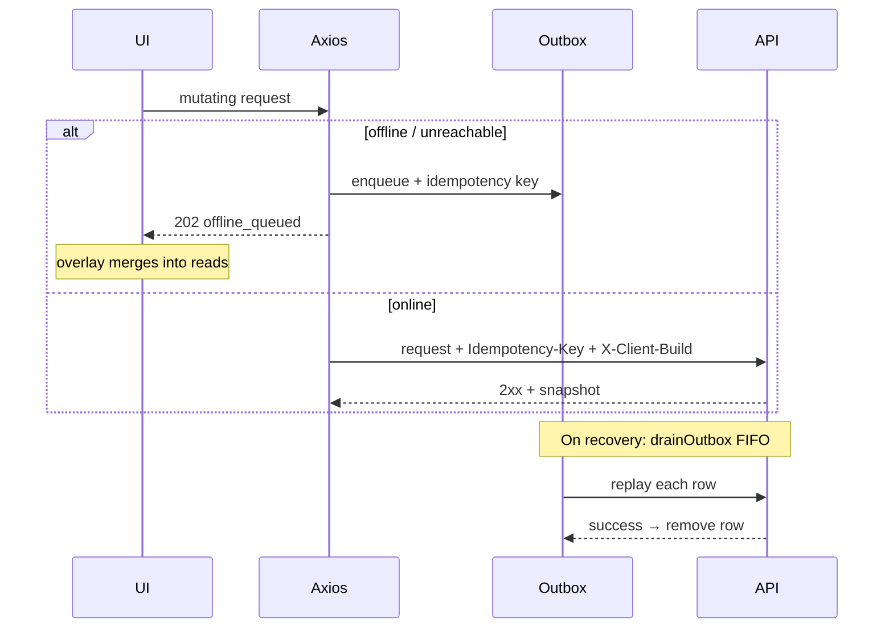

# PWA & Offline Sync

Related: [State & Data](03_State_and_Data.md) · [API Client & Auth](05_API_Client_and_Auth.md)

The flagship web client is an **installable PWA** with offline-first reads and an outbox for allowlisted writes. This page documents **web-repo implementation**; the cross-cutting contract is summarized in [`40_System_Design/12_Web_PWA_Install_Offline_Sync.md`](../40_System_Design/12_Web_PWA_Install_Offline_Sync.md). Server-side idempotency and build gates are in [`api_docs/05_Authentication_and_Security.md`](../api_docs/05_Authentication_and_Security.md).

> **Note:** Detailed D0–D4 research decisions live in the **private parent workspace** (not mirrored in this public vault). Treat the API middleware + this repo's `offline/` tree as the shipped contract.

## Install surface

| Asset | Location |
| :--- | :--- |
| Web manifest | [`public/manifest.webmanifest`](../../finance_manager_web/public/manifest.webmanifest) |
| Icons | `public/pwa-*.png` |
| SW generation | `vite-plugin-pwa` in [`vite.config.ts`](../../finance_manager_web/vite.config.ts) |
| Registration | [`src/registerPwa.ts`](../../finance_manager_web/src/registerPwa.ts) |
| Update prompt | [`SwUpdateBanner.tsx`](../../finance_manager_web/src/components/SwUpdateBanner.tsx) |

Manifest: `display: standalone`, `start_url: /`, theme `#0f172a`. Linked from `index.html`.

### Service worker strategy

- `registerType: "prompt"` — user prompted before applying waiting SW.
- Workbox `generateSW`: precache hashed assets; `navigateFallback: /index.html` with `navigateFallbackDenylist: [/^\/api/]`.
- **No extra navigate route** — avoids hard offline document-load failure (comment in vite config).
- **Version eviction:** `version.json` (custom Vite plugin) compared on interval; mismatch unregisters SW + reloads.

## Offline write allowlist

[`src/offline/allowlist.ts`](../../finance_manager_web/src/offline/allowlist.ts) must stay aligned with API `PwaWriteContractMiddleware`.

| Method | Path pattern |
| :--- | :--- |
| `POST` | `/finance/transactions/`, `/finance/upcoming_expenses/`, `/finance/categories/`, `/finance/sources/` |
| `PATCH`/`DELETE` | `/finance/transactions/<id>/` |
| `PATCH`/`PUT`/`DELETE` | `/finance/upcoming_expenses/<name>/` |
| `PATCH`/`DELETE` | `/finance/categories/<name>/`, `/finance/sources/<name>/` |
| `POST`/`PATCH`/`DELETE` | `/finance/tags/` |
| `PATCH` | `/finance/appprofile/` |

**Not allowlisted (online-only):** password change, account delete, support tickets, savings goal writes, export downloads, goals CRUD mutations.

## Queue → drain flow

### Drain rules ([`offline/drain.ts`](../../finance_manager_web/src/offline/drain.ts))

| Response | Behavior |
| :--- | :--- |
| 2xx | Remove row; invalidate query keys |
| 401 | Stop drain; `auth_blocked` — user must re-auth |
| 409 `CLIENT_BUILD_UNSUPPORTED` | Stop; show upgrade gate |
| 4xx | Stop; user must fix payload |
| 5xx / network | Retry on next reachability recovery |

[`OfflineRoot.tsx`](../../finance_manager_web/src/offline/OfflineRoot.tsx) runs probe on mount, `online` event, visibility change, and ~25s interval. Drain runs on **reachability recovery** only (`isApiReachabilityRecovery`), not every tick.

Mounted for `/app/*` routes or standalone PWA — **not** on public `/` in a browser tab (prevents logged-in marketing-page sync).

## Read overlays

Pending outbox rows merge into cached GET responses:

| Overlay module | Affects |
| :--- | :--- |
| `transactionOutboxOverlay.ts` | Transaction lists, snapshot tx-derived slices |
| `lookupsOutboxOverlay.ts` | Sources, categories, tags |
| `upcomingOutboxOverlay.ts` | Bills list + unpaid names |
| `profileOutboxOverlay.ts` | Profile fields + snapshot `source_balances` |

FIFO ordering preserves dependent writes (e.g. create category then create transaction).

## Seed window (installed PWA)

[`offline/seed.ts`](../../finance_manager_web/src/offline/seed.ts) — once per browser profile (`offline_seed_v4` meta):

- ~92-day window of snapshots, transaction lists, lookups, calendar (3 granularities × months), visualization, balance history (30d/90d), exchange rates.
- Runs after install / first authenticated PWA session.

## Connectivity probe

[`offline/connectivity.ts`](../../finance_manager_web/src/offline/connectivity.ts):

- `GET /api/health/` against configured API base.
- `markApiReachable()` on successful API responses (Axios interceptor).
- `isLikelyNetworkFailure(error)` for retroactive queue on failed online writes.

## Sync UX components

| Component | When shown |
| :--- | :--- |
| `SyncProgressOverlay` | Full-screen during seed/drain on **installed PWA** |
| `SyncStatusBar` | Installed PWA or any `/app/*` browser session |
| `OfflineHistoryBanner` | Stale/offline data disclaimer when applicable |

## Offline parity gaps (document honestly)

| KPI / surface | Offline behavior |
| :--- | :--- |
| `safe_to_spend`, `total_remaining_expenses` | May lag until server snapshot refetch after drain |
| Savings goals writes | Blocked offline |
| Export CSV/JSON | Requires network |
| Support tickets | Requires network |
| Calendar/viz | Served from cache + overlays when seeded; may be empty on fresh browser install offline |

Client-side snapshot math in overlays adjusts **source balances** and list totals from queued txs — it does **not** reimplement full API `Calculator` STS logic.

## Operator verification

- Parent monorepo: `deploy/BLUEGREEN_SWITCHOVER.md`, `scripts/fm_server_beta.sh smoke`.
- Web README: Lane A/B dev, jsdevtesting tunnel, VPS `scripts/vps-serve.sh`.
- Installed PWA smoke: exercise post-switch origin on `:8443` per ecosystem deploy protocol (private parent `governance/deployment_protocol.md`).

## Changing the offline contract

1. Update API `PwaWriteContractMiddleware` allowlist + tests.
2. Update `offline/allowlist.ts` + Vitest.
3. Add/adjust overlay merge for any new read surface.
4. Document in `api_docs` and this page.
5. Bump seed version marker if cache shape changes.

---

**[Return to Overview](00_Web_Overview.md)** · **Next:** [API Client & Auth](05_API_Client_and_Auth.md)
